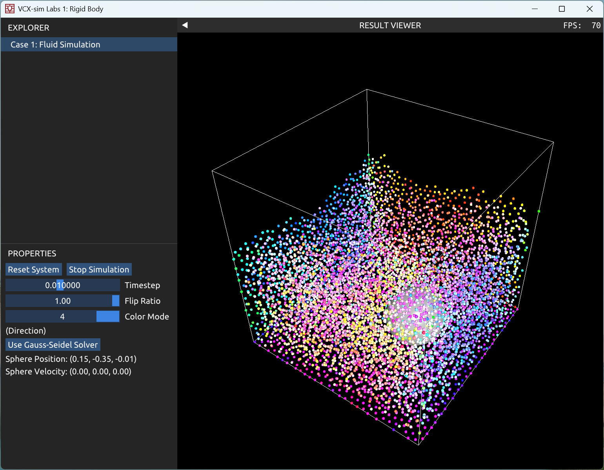
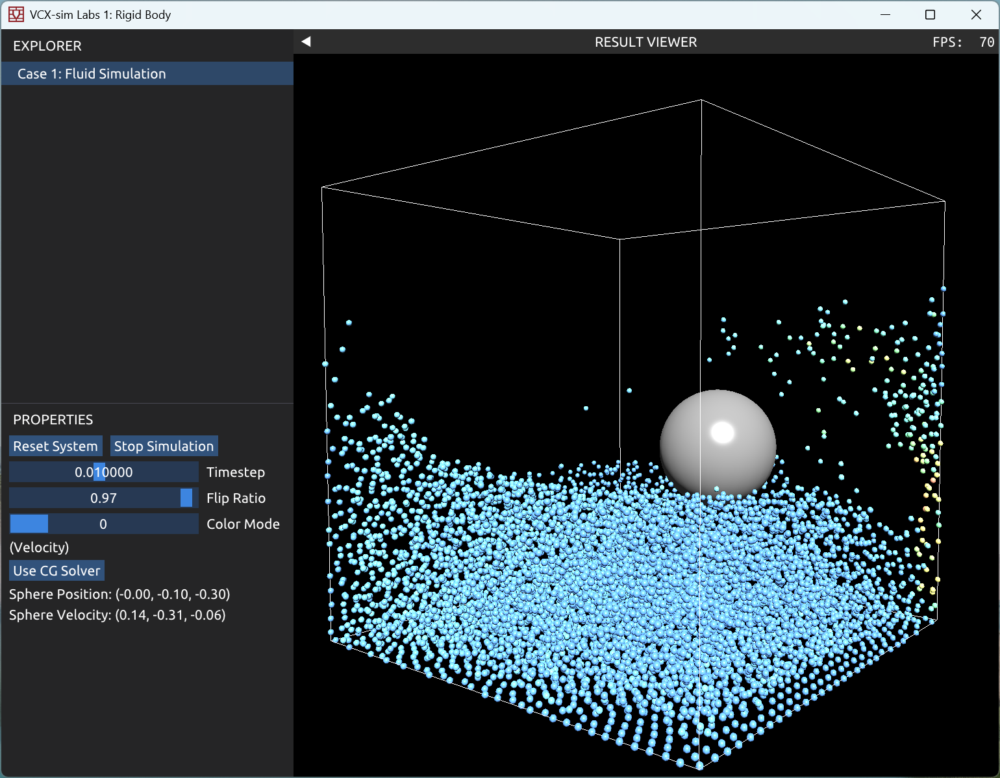

PhySim 王瑞 2400012957 Lab2
# FLIP
### FLIP 流体模拟
`FluidSimulator.cpp`中实现了时间步循环中 FLIP 流体模拟基本步骤的各个关键函数：
- `integrateParticles`：根据重力，使用显示欧拉积分更新粒子的速度和位置；
- `handleParticleCollisions`：检查边界条件以及处理球形障碍物与粒子的碰撞. 当粒子朝边界或障碍物碰撞时，将其位置进行修正并重置速度；
- `pushParticlesApart`：经过一定次数迭代，将距离过近的粒子推开. 使用了哈希表加速附近粒子的查询；
- `transferVelocities`：实现了粒子与网格之间速度信息的转换. 当`toGrid == true`时，将粒子速度通过插值贡献到附近的网格上，同时标记各个网格的状态（`SOLID_CELL`，`FLUID_CELL`或`EMPTY_CELL`）；当`toGrid == False`时，则将网格上的速度通过插值作为粒子速度的更新，`flipRatio`控制 FLIP 更新方法的权重；
- `updateParticleDensity`：根据各个粒子位置计算各个网格的密度；
- `solveIncompressibility`：使用 Gauss-Seidel 迭代的方法处理流体不可压缩性质，采用`overRelaxation = 1.5f`.

初始化时，将场景设置为$1 \times 1 \times 1$大小的正方体空间，并将空间划分为$(res+2)^3$的网格，$res$设定为32其中最外层网格指定为 SOLID 状态，流体粒子初始设定在空间后下半部分的网格中，每个粒子占据一个网格并施加随机扰动.

在 demo 中，当 flipRatio 在$0.9$以下时，流体会呈现很明显的黏性，在与障碍物交互时，速度基本上很快耗散；在$0.98$左右以上时，能一定时间内维持速度，形成漩涡等流体的现象.

### demo 功能
在`CaseFluid.cpp`中实现了 FLIP 流体模拟的 demo 演示，可以显示正方体空间，各个流体粒子以及障碍物的状态. demo 允许调正时间步大小和 flipRatio；demo 还提供了若干种流体粒子着色方法，可以反映流体粒子运动速度大小，压强，密度，以及位置和运动方向（依此对应 Color Mode 1 ~ 5），其中，前三种着色方案根据对应物理量大小映射到蓝色到红色之间，后两种着色方案将三维向量映射到三个颜色通道；同时，demo 实现了鼠标直接拖动球体障碍物与流体交互的功能.

### `SolveIncompressibilityCG`
`FluidSimulator.cpp`中还实现了采用 CG 方法求解线性方程来处理流体不可压缩性质的函数`SolveIncompressibilityCG`. 函数借助`Eigen`库构造稀疏矩阵，并使用`Eigen::ConjugateGradient`求解器求解压强，并进而更新各个网格的速度.

采用 CG 求解器时，可以对网格整体同时进行求解，相比 Gauss-Seidel 迭代方法可以观察到流体整体体积更大，流体与球形障碍物交互时，流体呈现更强的不可压缩性，不同位置的流体都能产生明显的影响. 在$res=32$的分辨率下，CG 求解器的效率基本足够.

#### Screenshots
|  |  |
| :-: | :-: |