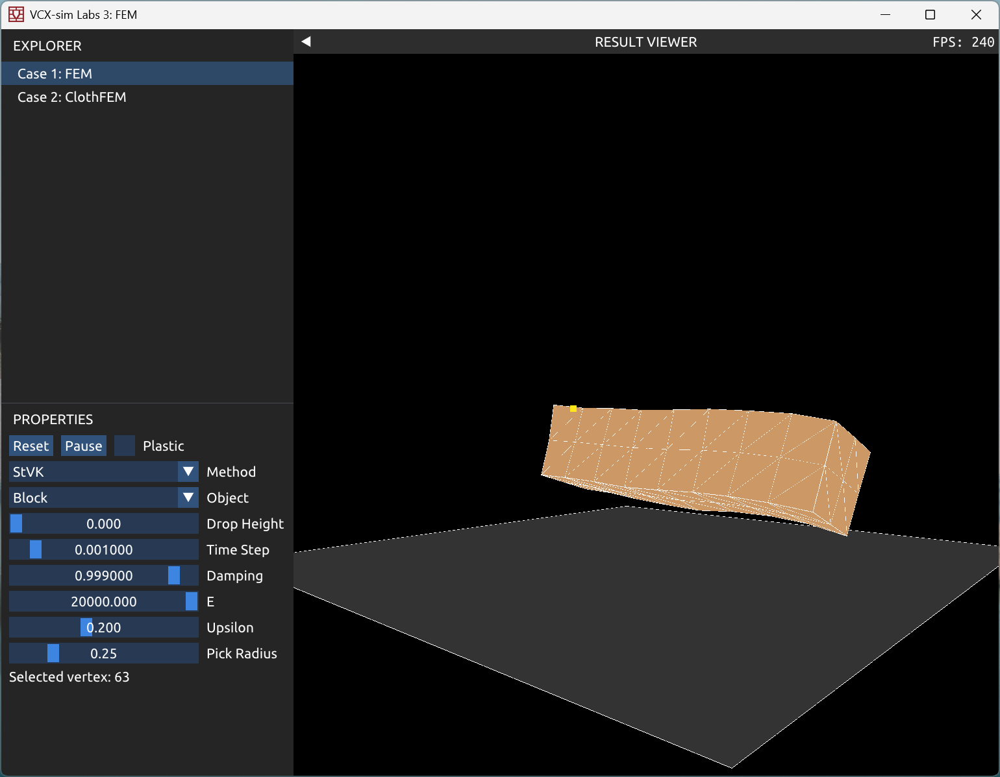
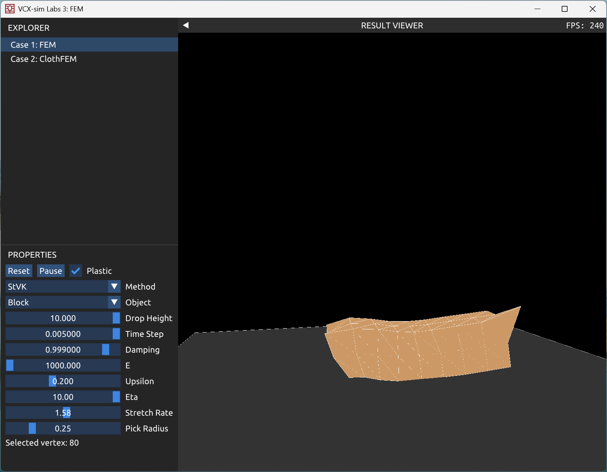
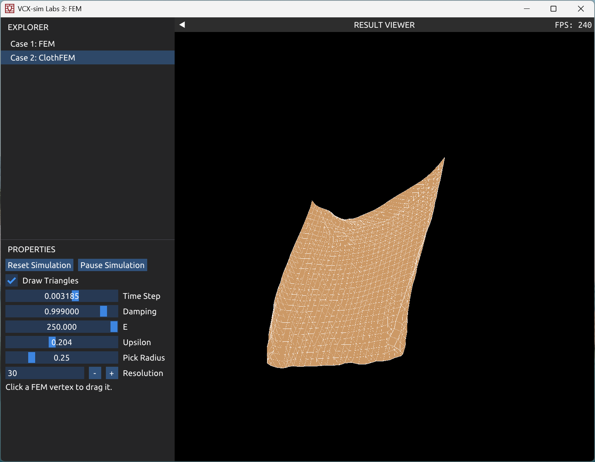
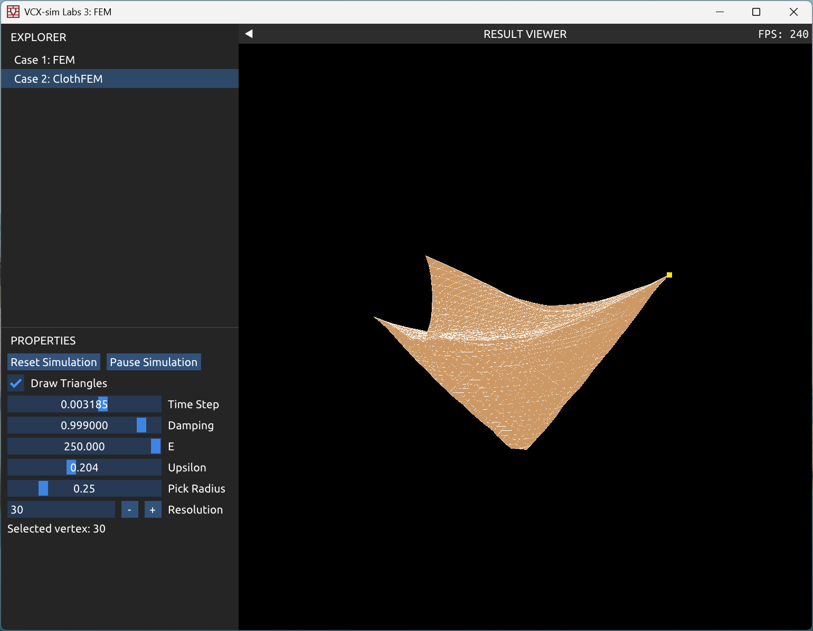

PhySim 王瑞 2400012957 Lab3
# FEM
### FEM 软体模拟
`FEMSystem.cpp`中实现了基于 FEM 方法的软体的物理模拟. 具体而言，实现了一个类`FEMSystem`. 对于一个弹性的物体，我们将其表达为多个四面体的组合，而类中的`Indices`表示每个四面体四个顶点的编号. 为了实现弹性体的物理仿真，在`FEMSystem`中，为每个顶点保存以下的信息：
- `Positions` 顶点位置；
- `Masses` 顶点分摊的质量；
- `Velocities` 顶点的速度；

以及为每个四面体单元保存以下的信息：
- `E` 四面体各个边向量构成的矩阵，$E=\left(p_1 - p_0\ p_2 - p_0\ p_3 - p_3\right)$；
- `inv_E` 矩阵`E`的逆；
- `Volumes` 四面体的体积，$V = \frac16\left|\det E\right|$.

系统还包含与弹性体物理仿真相关的参数，包括：
- `mu`，`lambda` 拉梅参数，可以根据杨氏模量和泊松比来计算：
$$
\mu = \frac E{2(1+\upsilon)}, \lambda = \frac{E\upsilon}{(1+\upsilon)(1 - 2\upsilon)};
$$
- `damping` 速度衰减系数，每次时间步积分后将速度乘以`damping`，引入 damping 能使物理模拟过程更加稳定.

#### 初始化
`reset(tet_index, tet_vertex_position)`函数提供了系统初始化的方法. 给定的输入描述了弹性体的四面体结构，初始化时，会计算每个四面体的矩阵`E`，`inv_E`，并进一步计算体积，同时将每个四面体体积对应的质量均摊给对应的四个顶点.

#### 时间步模拟
`simulateTimestep(dt, method, f_ext)`提供了 FEM 弹性体系统的时间步模拟方法. 初始，遍历每个四面体单元，根据当前四面体各个顶点位置状态计算应力，给每个顶点累加受到的内力. 之后，直接通过`integrateTimestep(dt, f_ext)`，采用显示时间积分进行各个顶点速度与位置的更新. 在`integrateTimestep`中，也进行了简单的地面碰撞检测，对于位置低于地面（y = -5）的顶点，令其速度反弹.

在计算 PK stress 的部分，代码先计算 deformation gradient 矩阵`F`，然后实现了 StVK，Neo Hookean，Corotated 三种模型的计算：
- StVK：
$$
G = (F^\bold TF - I) / 2, \\
P = F(2\mu G + \lambda\mathrm{tr}(G)I);
$$
- Neo_Hookean：
$$
J = \det F, \\
P = \mu(F - F^{-\bold T}) + \lambda\log J F^{-\bold T};
$$
- Corotated：
$$
E = S - I, \\
P = R(2\mu E + \lambda\mathrm{tr}(E)I),
$$其中$R$是$F$中的旋转成分，$S$是$F$的拉伸成分. 可以对$F$做极分解$F=RS$得到. 实际实现时，采用了 Eigen 库的 SVD 分解器，得到$F=U\Sigma V^\bold T$之后，可以得到$R = UV^\bold T, S=V\Sigma V^\bold T$.

计算出$P$后，就能得到各个顶点的受力：
$$
(f_1\ f_2\ f_3) = f = -V_0PE^{-\bold T}.
$$当然，顶点$p_0$的受力就是$f_0=-(f_1 + f_2 + f_3)$.

#### 弹塑性/粘弹性材料模拟
`FEMSystem.cpp`中，还提供了弹塑性/粘弹性物体的物理模拟.

##### 塑性材料的模拟
对于弹塑性材料，根据提供的最小实现方法，当前的 deformation gradient 可以分解为$F = F_eF_p$，其中$F_e,F_p$分别表示弹性和塑性的形变. 在实现时，需要为每个四面体单元额外记录一个当前的塑性形变$F_p$. 计算 PK stress 前，首先消除当前的塑性变形部分$F' = FF_p^{-1}$，然后对$F'$进行 SVD 分解$F=U\Sigma V^\bold T$. 对$\Sigma$中的奇异值进行裁剪：$\sigma_i' = \mathrm{clamp}(\sigma_i, \sigma_{\min}, \sigma_{\max})$，重新得到当前的弹性变形的成分$F_e = U\Sigma'V^\bold T$，而被裁减的部分即为塑性变形，更新$F_p' = F_e^{-1}F$. 得到$F_e$后，使用任意一种模型计算 PK stress：$P_{elastic} = P_{}(F_e)F_p^{-\bold T}$.

$\sigma_{\min},\sigma_{\max}$控制了弹性形变的极限. 调整$\sigma_{\min},\sigma_{\max}$，可以看到物体塑性压缩/拉伸的能力相应地改变.

##### 粘性材料的模拟
对于黏弹性材料，我们还需为每个四面体单元记录上一帧的形变$F_{prev}$. 粘性项即可用差分来近似计算：
$$
F' \approx (F - F_{prev}) / \Delta t, \\
P = P_{elastic} + \eta F'.
$$

$\eta$控制了材料粘弹性的大小. $\eta$越大，可以观察到物体形变存在明显阻尼效果.

### FEM 布料模拟
`FEMSystem2d.cpp`中实现了基于 FEM 方法的二维布料在三维空间中的模拟. 具体而言，实现了一个类`FEMSystem2D`，其具体实现与三维弹性体的`FEMSystem`类似，但表达物体的单元为三角形而非四面体，初始化时，会将坐标系转换到三角形所在的平面，从而计算相应的$2\times2$矩阵`E`，`inv_E`. 而在后续时间步模拟中，用与三维物体模拟类似的计算方法即可. 这里采用了 StVK 模型计算应变：
$$
D_s = (p_1 - p_0\ p_2 - p_0), \\
F = D_sE^{-1}, \\
G = (F^\bold TF - I) / 2, \\
P = F(2\mu G + \lambda\mathrm{tr}(G)I), \\
f = -A_0PE^{-\bold T},
$$其中$A_0$表示三角形初始的面积，最终得到的$2\times3$矩阵$f = (f_1\ f_2)$就是三角形各个顶点的受力.

### demo 功能
在`CaseFEM.cpp`中实现了 FEM 弹性物体模拟的 demo 演示. demo 会展现地面与物体，物体表面也会显示四面体单元形成的网格与个点. demo 提供了若干种简单的物体模型，允许调整初始物体的高度，时间步大小与速度衰减系数，以及调整杨氏模量和泊松比，可以选择计算应力的模型方法，包括 StVK，Neo_Hookean 和 Corotated 三种模型，可以选择是否引入弹塑性/粘弹性因素（Plastic），当勾选 Plastic 选项时，可以进一步调整 eta 和 stretchRate，后者会影响 FEM 的系统参数$\sigma_{\min}$和$\sigma_{\max}$. demo 实现了鼠标交互功能，可以在模拟过程中点击物体的四面体顶点进行拖动.

在`CaseClothFEM.cpp`中实现了基于 FEM 方法的布料模拟 demo 演示. 场景会初始化一张正方形布料，其中两个正方形端点固定，布料上也可以显示三角形网格（可选）. demo 允许调整 Timestep，Damping，以及杨氏模量和泊松比，同时，也允许调整布料三角形网格的分辨率，允许调整的范围在 5 到 50 之间. demo 同样实现了鼠标交互功能，可以在模拟过程中点击三角形网格格点进行拖动.

#### Screenshots
|  |  |
| :-: | :-: |
|  |  |